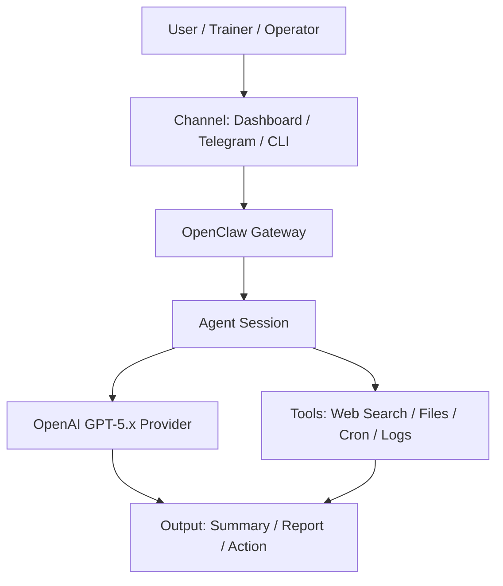

# How to Use OpenClaw with OpenAI GPT-5.x


> คู่มือมาตรฐานสำหรับติดตั้ง กำหนดค่า ตรวจสอบสถานะ และใช้งาน **OpenClaw** ร่วมกับ **OpenAI GPT-5.x** เพื่อสร้าง AI Agent สำหรับ Dashboard, Telegram, Web Search, File Workflow และ Cron Automation อย่างเป็นระบบ ปลอดภัย และควบคุมต้นทุนได้

---

## Table of Contents

- [Overview](#overview)
- [Repository Structure](#repository-structure)
- [Who This Repository Is For](#who-this-repository-is-for)
- [Core Use Cases](#core-use-cases)
- [Architecture](#architecture)
- [Quick Start](#quick-start)
- [Documentation Map](#documentation-map)
- [Operating Standards](#operating-standards)
- [Security Baseline](#security-baseline)
- [Troubleshooting First Steps](#troubleshooting-first-steps)
- [Roadmap](#roadmap)
- [Contributing](#contributing)
- [License](#license)

---

## Overview

**OpenClaw** ทำหน้าที่เป็น AI-agent gateway ระหว่างผู้ใช้ ช่องทางสื่อสาร เครื่องมือภายนอก และ model provider เช่น OpenAI โดย repository นี้จัดทำขึ้นเป็น **practical operating guide** สำหรับผู้ใช้ที่ต้องการนำ OpenClaw ไปใช้งานจริงหรือใช้สอนใน workshop

แนวทางของ repository นี้เน้น 5 เรื่องหลัก:

1. ติดตั้งและตรวจสอบ OpenClaw ให้พร้อมใช้งาน
2. เชื่อม OpenAI provider อย่างปลอดภัย
3. กำหนด model, fallback, alias และ gateway อย่างเป็นระบบ
4. ใช้งาน Dashboard, Telegram, Web Search, File Workflow และ Cron Automation
5. ควบคุม API key, token, cost, rate limit และ context overflow

---

## Repository Structure

```text
.
├── README.md
├── LICENSE
├── CHANGELOG.md
├── CONTRIBUTING.md
├── docs/
│   ├── architecture.md
│   ├── installation.md
│   ├── model-configuration.md
│   ├── security.md
│   ├── troubleshooting.md
│   └── cron-automation.md
├── examples/
│   ├── config/
│   │   └── .env.example
│   └── prompts/
│       └── daily-brief.md
└── .github/
    └── PULL_REQUEST_TEMPLATE.md
```

| Path | Purpose |
|---|---|
| `README.md` | หน้าแรกของ repository และแผนที่การใช้งานทั้งหมด |
| `docs/` | เอกสารปฏิบัติการแยกตามหัวข้อ เพื่อให้อ่านง่ายและ maintain ได้ |
| `examples/config/.env.example` | ตัวอย่าง environment variables แบบไม่มี secret จริง |
| `examples/prompts/` | ตัวอย่าง prompt สำหรับงานสอน งานทดลอง และ automation |
| `.github/PULL_REQUEST_TEMPLATE.md` | Template ตรวจคุณภาพก่อน merge |
| `CHANGELOG.md` | บันทึกการเปลี่ยนแปลงของ repository |
| `CONTRIBUTING.md` | แนวทางการปรับปรุงเอกสารและส่ง PR |

---

## Who This Repository Is For

| Audience | Use Case |
|---|---|
| ผู้เริ่มต้นใช้ AI Agent | ติดตั้ง OpenClaw และทดสอบ provider/model |
| IT instructors / trainers | ใช้เป็นคู่มือสอนหรือ workshop handout |
| Developers | ใช้เป็น runbook สำหรับตั้งค่า gateway, model และ automation |
| Knowledge workers | ใช้ AI Agent ช่วยสรุป ค้นหา จัดหมวด และสร้างรายงาน |
| Operations / governance users | วางมาตรฐาน security, token hygiene และ cost control |

---

## Core Use Cases

| Use Case | Description | Recommended Control |
|---|---|---|
| Daily Brief | สรุปข่าวหรือข้อมูลรายวัน | จำกัดจำนวนแหล่งข้อมูลและความยาวคำตอบ |
| Document Summary | สรุปไฟล์หรือเอกสาร | แบ่งไฟล์เป็นส่วนย่อยก่อนประมวลผล |
| Classification | จัดหมวดข้อมูลหรือเงื่อนไข | ใช้ prompt ที่มี output format ชัดเจน |
| Web Search Agent | ค้นข้อมูลล่าสุดและสรุปพร้อมแหล่งอ้างอิง | เปิด web provider และตรวจ source ทุกครั้ง |
| Cron Automation | ตั้งงานอัตโนมัติรายวัน/รายสัปดาห์ | ใช้ session แยกและจำกัด output |
| Telegram Agent | สนทนากับ agent ผ่าน Telegram | ป้องกัน token และ reset session เมื่อ context ใหญ่เกินไป |

---

## Architecture



อ่านรายละเอียดเพิ่มเติมได้ที่ [`docs/architecture.md`](docs/architecture.md)

---

## Quick Start

```bash
# ตรวจสอบว่า OpenClaw ถูกติดตั้งและเรียกใช้งานได้
openclaw --version
openclaw doctor

# ตรวจสอบสถานะ gateway ก่อนเริ่มใช้งานจริง
openclaw gateway status

# เชื่อม OpenAI provider ผ่าน OpenClaw
openclaw models auth login --provider openai

# ตรวจรายการ model ที่บัญชีและ provider รองรับจริง
openclaw models list --provider openai

# ตรวจสถานะ model และทดสอบ probe
openclaw models status
openclaw models status --probe

# เปิด Dashboard เพื่อดูสถานะระบบผ่าน UI
openclaw dashboard
```

> อย่า hardcode model ID จากเอกสารนี้โดยไม่ตรวจ catalog ปัจจุบันก่อน ให้ใช้ผลจาก `openclaw models list --provider openai` เป็นแหล่งอ้างอิงก่อนตั้งค่า model ทุกครั้ง

---

## Documentation Map

| Document | Description |
|---|---|
| [`docs/architecture.md`](docs/architecture.md) | อธิบายภาพรวม gateway, provider, session, tools และ output flow |
| [`docs/installation.md`](docs/installation.md) | ขั้นตอนติดตั้ง ตรวจสอบ และเปิด Dashboard |
| [`docs/model-configuration.md`](docs/model-configuration.md) | แนวทางตั้งค่า OpenAI provider, model, fallback และ alias |
| [`docs/security.md`](docs/security.md) | API key, token hygiene, secret handling และ log sanitization |
| [`docs/troubleshooting.md`](docs/troubleshooting.md) | อาการผิดพลาดที่พบบ่อยและวิธีตรวจทีละขั้น |
| [`docs/cron-automation.md`](docs/cron-automation.md) | แนวทางออกแบบ scheduled job แบบ cost-safe |
| [`examples/prompts/daily-brief.md`](examples/prompts/daily-brief.md) | prompt ตัวอย่างสำหรับ daily brief |
| [`examples/config/.env.example`](examples/config/.env.example) | environment variable template แบบไม่มีข้อมูลลับ |

---

## Operating Standards

### Code Fence Standard

| Block Type | Fence | Use For |
|---|---|---|
| Shell command | `bash` | คำสั่ง terminal ที่ผู้ใช้สามารถ copy ไป run ได้ |
| Terminal output | `console` | ตัวอย่างผลลัพธ์จาก terminal |
| Prompt/template | `markdown` or `text` | prompt, checklist, template, policy text |
| Diagram | `mermaid` | architecture, workflow, sequence, decision flow |

### Shell Comment Standard

```bash
# ใช้ comment ภาษาไทยแบบปกติเพื่ออธิบายเหตุผลของคำสั่ง
openclaw models status --probe
```

ไม่ใช้ marker ลักษณะ debug เช่น `XXX`, `TODO` หรือคำที่ทำให้เอกสารดูไม่เป็นทางการ เว้นแต่เป็นงาน backlog จริง

---

## Security Baseline

ห้าม commit หรือแสดงข้อมูลต่อไปนี้ใน repository, screenshot, slide, chat หรือ shared terminal:

```text
API keys
Gateway tokens
Telegram bot tokens
Passwords
Session tokens
.env files with real values
Auth profiles
Logs containing secrets
```

ใช้ [`examples/config/.env.example`](examples/config/.env.example) เพื่อสอนรูปแบบตัวแปรเท่านั้น และใช้ [`docs/security.md`](docs/security.md) เป็น checklist ก่อนเผยแพร่เอกสารหรือ log

---

## Troubleshooting First Steps

```bash
# ตรวจสุขภาพ OpenClaw เบื้องต้น
openclaw doctor

# ตรวจสถานะ gateway
openclaw gateway status

# ตรวจ provider และ model
openclaw models auth list
openclaw models status --probe

# ตรวจ logs เมื่อยังไม่พบสาเหตุ
openclaw logs --follow
```

ดูรายละเอียดเพิ่มเติมใน [`docs/troubleshooting.md`](docs/troubleshooting.md)

---

## Roadmap

- [ ] Add a brand/title banner for README
- [ ] Add workshop slide outline
- [ ] Add hands-on lab worksheet
- [ ] Add model-selection checklist
- [ ] Add Thai/English glossary for AI-agent operations
- [ ] Add example workflows for Telegram, Web Search, File Summary, and Cron

---

## Contributing

อ่านแนวทางใน [`CONTRIBUTING.md`](CONTRIBUTING.md) ก่อนเปิด PR

มาตรฐานสำคัญ:

- ใช้ branch แยกจาก `main`
- ไม่ commit secrets หรือไฟล์ `.env` จริง
- ใช้ code fence language tag ให้ถูกต้อง
- ใส่ comment ภาษาไทยใน code block เมื่อเป็นสื่อสอน
- เปิด PR แบบ draft เพื่อ review ก่อน merge

---

## License

This repository is released under the MIT License. See [`LICENSE`](LICENSE) for details.
