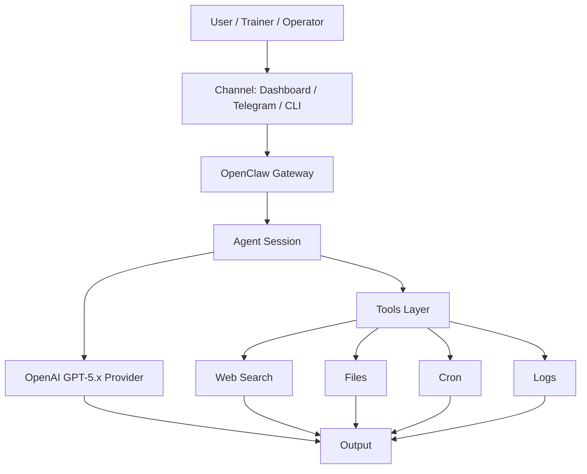

# Architecture Guide

> เอกสารนี้อธิบายโครงสร้างการทำงานของ OpenClaw เมื่อเชื่อมกับ OpenAI GPT-5.x เพื่อให้ผู้ใช้เข้าใจ flow ก่อนเริ่มตั้งค่าจริง

---

## System Flow

---

## Component Responsibilities

| Component | Responsibility |
|---|---|
| Channel | รับคำสั่งจาก Dashboard, Telegram หรือ CLI |
| Gateway | จัดการ routing, session, provider และ tool access |
| Agent Session | เก็บ context ของงานและควบคุม workflow |
| Model Provider | ประมวลผล reasoning, generation และ classification |
| Tools Layer | เชื่อม web search, file workflow, cron และ logs |
| Output | ส่งผลลัพธ์เป็น summary, report, action item หรือข้อความตอบกลับ |

---

## Teaching Notes

- OpenClaw ไม่ใช่ model โดยตรง แต่เป็น gateway/orchestration layer
- OpenAI เป็น provider ที่ให้บริการ model
- Tool access ต้องถูกควบคุม เพราะมีผลต่อข้อมูล ต้นทุน และความปลอดภัย
- Cron automation ควรใช้ session แยกและจำกัด output เสมอ
